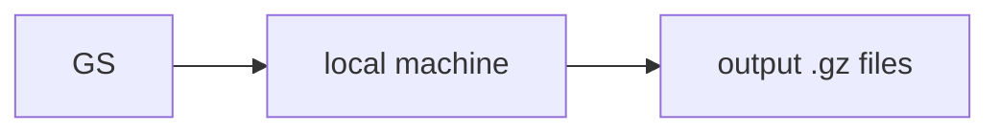

# Transactions Data Pipeline

### How to run
1) Clone repo into your local machine 
2) CD into the newly cloned folder
3) Run the script using this command: `python index.py`

### Pipeline Diagram 
